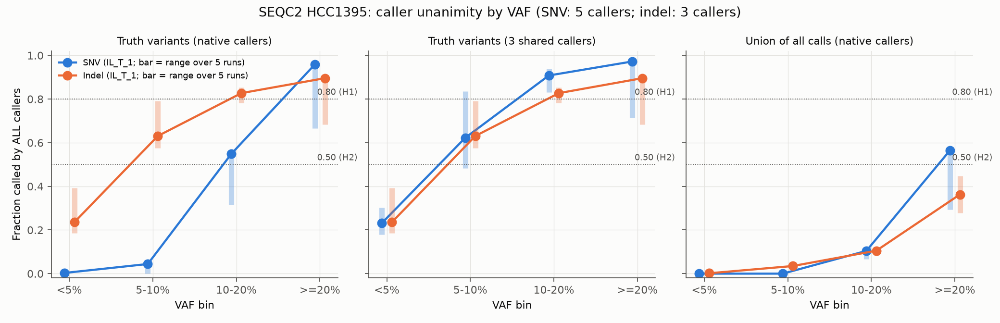
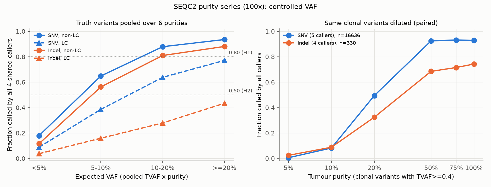
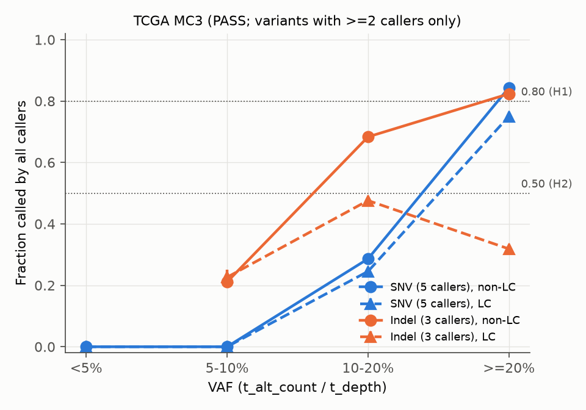
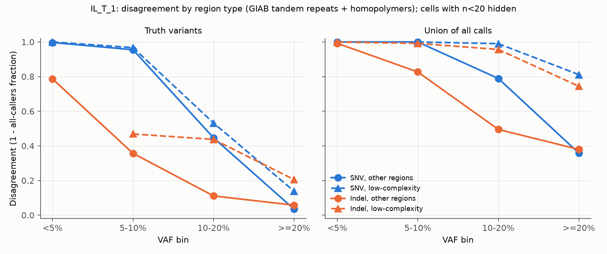
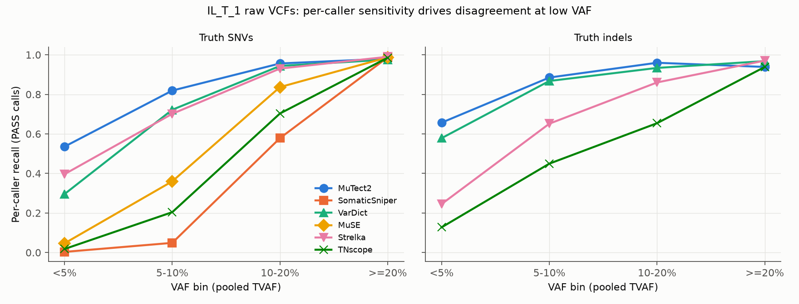

# Do Somatic Variant Callers Agree on the Same Tumor Sample?

A stratified analysis of multi-caller agreement by VAF, variant type and low-complexity context. Data:
- SEQC2 HCC1395, 5 sequencing runs;
- the SEQC2 tumor-purity dilution series;
- TCGA MC3, 10,074 exomes.

## 1. Executive Summary

**Question.** When several somatic callers analyse the same tumor, how often do they all agree? Does agreement exceed 80% above 20% VAF, fall below 50% under 5% VAF, and is it lowest for indels and in low-complexity (LC) regions at every VAF?

**Answer.** The hypothesis is **partly supported**, and the verdict depends on what "variants" means.

**VAF effect (H1/H2): strong and causal.**
- *Real (truth-set) variants.* In the 4 standard-depth (~30–60×) runs, unanimity at ≥20% VAF was 88–96% for SNVs and 86–91% for indels. It was ≤0.3% for SNVs and 19–37% for indels below 5% VAF. **H1 and H2 both hold here.**
- *Dilution confirms it is VAF itself.* Diluting the same 16,636 clonal SNVs from 100% to 5% tumor purity cut 5-caller unanimity from 93% to 0.6% (McNemar p≈0).
- *All calls.* If "variants" means every call any caller makes (the call union), **H1 fails badly.** Only 29–56% of SNV calls and 28–45% of indel calls at ≥20% VAF are made by every caller. Most calls are single-caller calls: 63% of SNVs and 70% of indels.

**Low complexity (H4): clearly supported.** Wherever the metric is not at its floor, LC regions (GIAB tandem repeats and homopolymers) disagreed more than other regions in every VAF bin. LC odds ratios for unanimity were:
- 0.02–0.31 on the call union;
- 0.14–0.72 on truth variants.

No bin showed a significant reversal. Below 5–10% VAF, unanimity is ≈0 in both LC and non-LC regions, so "regardless of VAF" holds only in the trivial sense there.

**Indels (H3): only conditionally supported.**
- Indels disagree more than SNVs at **≥20% VAF** in every dataset.
- With matched (like-for-like) caller sets, indels also disagree more at 5–20% VAF on the call union, and in every bin of the pooled dilution series. The exception is <5% VAF on the SEQC2 union, where both types are at the ≈0-agreement floor.
- With each type's native caller set, the ranking **reverses** at low VAF. SNV panels include SomaticSniper, which makes almost no true calls below 10% VAF, so SNV unanimity collapses faster than indel unanimity.
- MC3 shows the same reversal.

"Indels are always worse regardless of VAF" is therefore not true as stated. The ranking depends on which callers are compared.

**Practical implication.** "All callers agree" is a high-precision filter for clonal variants. It silently discards almost every true subclonal (<10% VAF) variant, and much of the true signal in repeats. For low-VAF work, disagreement is mainly a sensitivity problem of the weakest caller (SomaticSniper, then MuSE and TNscope for SNVs; TNscope and Strelka for indels), so majority voting or caller-specific weighting is needed.

## 2. Research Question & Motivation

### Hypothesis, decomposed and pre-registered in `planning.md`
"Agree" means the variant is called by **all** callers in the set: 5 for SNVs and 3 for indels in SEQC2.
- **H1:** all-agree > 0.80 at VAF ≥ 20%.
- **H2:** all-agree < 0.50 at VAF < 5%.
- **H3:** disagreement is higher for indels than for SNVs in *every* VAF bin.
- **H4:** disagreement is higher in LC regions than in other regions in *every* VAF bin, for SNVs and for indels.

### Why it matters
Consensus calling is standard in cancer genomics (TCGA MC3, PCAWG, SEQC2). Whether a mutation is reported therefore depends on inter-caller agreement. The mutations most likely to be lost are also clinically important:
- subclonal mutations, which drive resistance;
- indels in repeats, which drive the MSI phenotype.

### Gap (from `literature_review.md`)
- Chen et al. 2020 is the only VAF-stratified concordance study, with 2 callers and SNVs only.
- Indel and repeat effects were reported without stratifying by VAF (Alioto 2015, Krøigård 2016).
- LC effects were inferred from germline GIAB work, or from somatic truth sets that simply excluded those regions (Jones 2021).
- Published numbers use different denominators, e.g. Goode 2013 at 46% on all calls vs Wang 2013 at 82% on validated variants.

### Our contribution
- A joint VAF × type × LC analysis with ≥5 callers on the same tumor.
- Two explicit denominators.
- A dilution experiment that varies VAF within the same variants.
- Replication on 10k TCGA exomes.

## 3. Literature Summary (condensed)
- **Chen 2020:** Strelka2/Mutect2 SNV concordance >90% at ≥10% VAF, 75–89% at 5%, 20–41% at 1%.
- **Goode 2013:** 3-caller agreement on all calls was only 46% even at VAF ≥20%.
- **Wang 2013:** 82% of validated SNVs were called by all 5 callers.
- **Alioto 2015:** 205 SNVs vs 1 indel were called by all pipelines; 83% of true indels lie in tandem repeats.
- **Krøigård 2016 and Guille 2025:** indels agree less, and indel F1 is lower.
- **Cibulskis 2013 and Sergi 2024:** caller sensitivities at ≤5% VAF differ several-fold.
- **Wang 2020 (SomaticCombiner):** VarScan and SomaticSniper collapse at ≤10% VAF.
- **Dwarshuis 2024 (GIAB):** defines the LC strata and shows elevated germline error in repeats.

Our numbers agree with these where they overlap (see §5.4).

## 4. Methodology

### 4.1 Data

| Experiment | Data | Callers compared | "Call" definition |
|---|---|---|---|
| **Exp 1 (D1)** | SEQC2 HCC1395 WGS, SomaticSeq ensemble tables for 5 runs: IL_T_1, NV_T_1, FD_T_1, NS_T_1 (~30–60×) and NS_380X (380×, 9 NovaSeq runs combined) | SNV: MuTect2, SomaticSniper, VarDict, MuSE, Strelka. Indel: MuTect2, VarDict, Strelka | See the flag rules below |
| **Exp 1b** | Raw per-caller VCFs for IL_T_1 | Adds TNscope. SNV: 6 callers. Indel: 4 callers | PASS only (VarDict: PASS + `STATUS=*Somatic`; SomaticSniper: SS=2 & SSC≥40) |
| **Exp 2 (D2)** | SEQC2 purity series, 100× WGS, purities 100 / 75 / 50 / 20 / 10 / 5% | TNscope, Lancet, MuTect2, Strelka, plus SomaticSniper for SNVs only | PASS. SomaticSniper files are pre-filtered to SS=2 & SSC≥40 |
| **Exp 3 (D3)** | TCGA MC3 public MAF (GRCh37). SNVs from 10,074 tumors; indels from 8,630 | SNV: MuTect, MuSE, VarScan2, SomaticSniper, RADIA. Indel: Indelocator, VarScan2-indel, Pindel | Caller listed in `CENTERS`; the `*` suffix counts as a call, consistent with `NCALLERS` |

Exp 1 flag rules (PASS-like; see `code/somaticseq/somaticseq/annotate_caller.py`):
- MuTect2: `if_MuTect==1`.
- VarDict: `==1` (PASS + Somatic).
- MuSE: `MuSE_Tier==1` (PASS).
- Strelka: `==1`.
- SomaticSniper: SS=2 and SSC≥40.
- A *lenient* variant also counts VarDict 0.5, any MuSE tier, and any SomaticSniper SS=2.

Exp 3 analysis rules:
- Only tumors in which **all** callers of the given type were active are used, so K is constant.
- Only variants with ≥2 callers are public, so MC3 agreement is conditional on at least 2 callers agreeing.

Truth set and region annotations:
- **Truth:** SEQC2 v1.2.1 high-confidence calls, 39,447 SNVs and 1,625 indels in HC regions, on chr1–22 and X.
- **Low complexity (LC):** GIAB v3.3 `AllTandemRepeatsandHomopolymers_slop5` (GRCh38 or GRCh37 as appropriate).
- **Covariates:** GIAB low-mappability and segmental duplications, plus SEQC2 HC regions.
- **Overlap:** computed with bedtools 2.31 on the REF span.

### 4.2 Denominators
- **Truth.** All truth variants, including those called by nobody. VAF = pooled `TVAF` from ~63 SEQC2 replicates, which is independent of the callers and of detection. In D2, the expected VAF is `TVAF × purity`.
- **Truth_obsvaf.** Robustness version: truth variants present in the run, with the VAF observed in that run.
- **Union.** Every site called by ≥1 caller. VAF comes from that run's tumor read counts (D1), or from the median caller-reported VAF (D2; about 5% of sites in D1b).
- **Union_hc.** The union restricted to SEQC2 high-confidence regions.

### 4.3 Metrics and statistics

Metrics per stratum:
- all-agree fraction (primary);
- strict majority (> K/2);
- mean fraction of callers (n/K);
- singleton fraction;
- mean pairwise Jaccard;
- Fleiss' κ;
- per-caller rate (recall on the truth set).

VAF bins: <5%, 5–10%, 10–20%, ≥20%.

Hypothesis tests:
- **H1/H2:** one-sided exact binomial test against 0.80 / 0.50, Holm-adjusted within each experiment.
- **H3/H4:** within-bin risk difference of disagreement, with a Newcombe 95% CI, and a χ² (or Fisher) test with Holm correction.
  - Cells with n<20 are excluded.
  - "Supported (all bins)" requires CI > 0 and p_Holm < 0.05 in every bin tested.
  - "Partial" means supported in some bins and not significantly reversed in any.
  - "Mixed" means significantly supported in some bins and significantly reversed in others.
- **Logistic GLMs:** `all_agree ~ VAF_bin × LC + log1p(depth) + lowmap + segdup`, fitted per type. A pooled like-for-like model adds `VAF_bin × is_indel`. Interactions are tested with likelihood-ratio tests.
- **D2:** a paired McNemar test for the same clonal variants (TVAF ≥ 0.4) at each purity vs 100%.
- **D3:** a sample-level cluster bootstrap (200 reps, seed 42) and per-sample macro averages.

Caller-set controls:
- The **shared3** (D1), **shared4** (D1b, D2) sets use the same callers for SNVs and indels, which gives a like-for-like H3 test.
- A **leave-one-caller-out** analysis (D1b) identifies which caller drives disagreement.

### 4.4 Environment and reproducibility
- **Software:** Python 3.12.8; pandas 3.0.5; numpy 2.5.3; scipy 1.18.1; statsmodels 0.15.0; pysam 0.24.1; pyfaidx 0.9.0.4; matplotlib 3.11.2; bedtools 2.31.0 (static).
- **Hardware:** AMD EPYC 7302 (32 threads), CPU only. No GPU was needed, since this is table and statistics work.
- **Runtime:** about 45 min end to end (`run_all.sh`). The D1 GLMs dominate (~25 min).
- **Randomness:** the only stochastic step is the D3 bootstrap (seed 42). D3 was re-run and its outputs compared byte-for-byte (§8).
- **Indel normalisation:** purity-series and raw VCF indels were normalised vt-style against hg38 before exact matching.
  - In D2 at 100% purity, 95.5% of truth indels were called by ≥1 caller after normalisation.
  - In D1, 93–99.8% of truth indels were present in the ensemble tables.
- **No LLMs** were used in the analysis. This is a bioinformatics study, so the LLM-API instructions do not apply.

## 5. Results

### 5.1 H1/H2: agreement vs VAF (Figure 1, Figure 3)

**Table 1.** All-callers fraction in SEQC2 (strict flags, native callers). Values are IL_T_1 [range over the 5 runs]. Full table: `results/d1_summary.csv`.

| Denominator | Type | <5% | 5–10% | 10–20% | ≥20% |
|---|---|---|---|---|---|
| Truth (TVAF) | SNV (5 callers) | 0.003 [0–0.003] | 0.044 [0.001–0.044] | 0.549 [0.317–0.549] | **0.959** [0.666–0.964] |
| Truth (TVAF) | Indel (3 callers) | 0.235 [0.186–0.392] | 0.631 [0.575–0.791] | 0.827 [0.782–0.853] | **0.896** [0.684–0.909] |
| Union of calls | SNV | 0.000 | 0.000 | 0.104 [0.066–0.104] | **0.564** [0.293–0.564] |
| Union of calls | Indel | 0.002 [0–0.007] | 0.035 [0.022–0.052] | 0.105 [0.081–0.121] | **0.363** [0.278–0.448] |

Truth-set sizes per bin, IL_T_1: SNV 1,292 / 3,853 / 6,271 / 28,030; indel 102 / 287 / 422 / 814. Union sizes: SNV 83,570 / 74,665 / 37,199 / 156,082; indel 17,556 / 6,587 / 5,939 / 19,452.

**H1 on the truth set.** Supported (one-sided p_Holm < 0.001) for both types in the 4 standard-depth runs, with SNVs at 0.877–0.964 and indels at 0.865–0.909.
- It is **not** supported in NS_380X: SNVs 0.666, indels 0.684.
- The cause is caller-specific. At 380×, MuTect2 recall at ≥20% VAF drops to 0.72 and MuSE to 0.68, while the other callers stay at 0.998 (`d1_summary.csv`, `rate_*` columns).
- Very deep data therefore does not automatically increase agreement.

**H1 on the union.** Rejected in every run and in every configuration: raw PASS, HC-restricted and lenient. In IL_T_1, the ≥20% SNV union contains only 18% truth-set sites, and **28% of its sites are single-caller calls**.

**H2.** Supported on the truth set for SNVs in all runs (≤0.3%). For indels it is supported in 4 of 5 runs (0.19–0.37); NS_380X is not significant (0.39, CI 0.30–0.49). It is supported everywhere on the union (≤0.7%).

**Majority agreement is much more forgiving** (IL_T_1 truth, SNVs): 0.235 at <5%, 0.647 at 5–10%, 0.941 at 10–20%, 0.996 at ≥20%.

**Robustness (Exp 1b: raw VCFs, PASS only, TNscope added).** The conclusions are unchanged:
- Truth ≥20%: SNV (6 callers) 0.933; indel (4 callers) 0.857.
- Truth <5%: 0.002 and 0.088.
- Union ≥20%: 0.548 and 0.240.

The lenient flag definition also gives the same qualitative pattern (`d1_summary.csv`, `flags=lenient`).

**Causal dilution test (Exp 2; Figure 3).** Pooling truth variants over 6 purities, with the 4 shared callers, all-agree by expected VAF was:

| Type | <5% | 5–10% | 10–20% | ≥20% |
|---|---|---|---|---|
| SNV | 0.174 | 0.632 | 0.864 | 0.925 |
| Indel | 0.100 | 0.472 | 0.672 | 0.730 |

95% CIs are within ±0.02 (`d2_pooled_expected_vaf.csv`).

For the same **clonal** variants (TVAF ≥ 0.4), all-caller agreement (SNV: all 5; indel: all 4) fell with purity:

| Purity | SNV (n=16,636) | Indel (n=330) |
|---|---|---|
| 100% | 0.928 | 0.742 |
| 50% | 0.925 | 0.685 |
| 20% | 0.494 | 0.324 |
| 10% | 0.082 | 0.088 |
| 5% | 0.006 | 0.024 |

For SNVs, 15,350 variants lost unanimity and only 1 gained it; McNemar p < 1e-300 (`d2_paired_clonal.csv`). Because the variants are identical, **VAF alone drives the H1/H2 pattern.**

**TCGA MC3 (Exp 3; Figure 4).**
- SNVs: all-5 agreement was 0.841 at ≥20% (cluster-bootstrap CI 0.838–0.844), 0.285 at 10–20%, and **0.000** below 10%.
- Indels: all-3 agreement was 0.638 at ≥20%, 0.643 at 10–20% and 0.213 at 5–10%. There are no indels below 5% in the public MAF.
- Per-tumor medians were similar: SNVs 0.844 at ≥20%, 0.000 at <10%.

The zeros below 10% are structural. MC3's SomaticSniper made no calls below 10% VAF (and only 0.30 at 10–20%), and VarScan2 made none below 5%. Every public <5% SNV is a MuTect+MuSE pair.

### 5.2 H4: low-complexity regions (Figure 2)

**Table 2.** All-callers fraction, IL_T_1, non-LC vs LC. Shared-3 callers (MuTect2, VarDict, Strelka) are used for both types.

| Denominator | Type / region | <5% | 5–10% | 10–20% | ≥20% |
|---|---|---|---|---|---|
| Truth | SNV non-LC | 0.231 | 0.626 | 0.916 | 0.977 |
| Truth | SNV LC | 0.240 (n=50) | 0.567 | 0.776 | 0.896 |
| Truth | Indel non-LC | 0.213 | 0.643 | 0.889 | 0.942 |
| Truth | Indel LC | 0.385 (n=13) | 0.531 (n=32) | 0.562 | 0.795 |
| Union | SNV non-LC | 0.002 | 0.093 | 0.419 | 0.794 |
| Union | SNV LC | 0.000 | 0.005 | 0.023 | 0.246 |
| Union | Indel non-LC | 0.008 | 0.173 | 0.505 | 0.620 |
| Union | Indel LC | 0.000 | 0.008 | 0.043 | 0.256 |

LC composition:
- 60% of union SNV sites and 88% of union indel sites (all runs combined) are in LC regions.
- For truth variants the shares are 6% (SNVs) and 24% (indels), which reflects the truth set's HC-region restriction.

**Within-bin tests.** No bin in any dataset showed LC significantly *better* (`results/verdicts_h3h4.csv`).

Verdict counts across all contexts:

| Experiment | Supported in all bins | Partial | Other |
|---|---|---|---|
| D1 | 39 | 50 | 1 mixed |
| D1b | 4 | 8 | — |
| D2 | 24 | 44 | 4 not significant |
| D3 | 0 | 3 | 1 not significant |

The "partial" verdicts arise almost entirely because, below 5–10% VAF, all-caller agreement is ≈0 in both LC and non-LC regions (a floor effect), or because truth LC cells are small.

**Where the effect is measurable, it is large:**
- Union, ≥20% VAF: LC disagreement exceeds non-LC by +0.45 for SNVs and +0.36 for indels (IL_T_1). Within HC regions the gaps are +0.72 and +0.38.
- Truth, 10–20% VAF: +0.09 for SNVs and +0.33 for indels.
- Dilution series (shared4, truth): LC is worse in every bin at 100% purity (SNV +0.09 to +0.23) and at 20% purity. Indels were worse in every tested bin at both purities (+0.10 to +0.45).
- MC3 at ≥20%: SNV +0.09 and indel +0.51.

**GLMs** (`results/d1_glm.csv`), adjusted for depth, low mappability and segmental duplications. LC odds ratio for unanimity:

| Denominator | SNV | Indel |
|---|---|---|
| Truth | 0.32–0.72 | 0.14–0.52 |
| Union | 0.12–0.16 | 0.18–0.31 |
| Union_hc | 0.02–0.06 | 0.04–0.06 |

All ORs have p < 1e-10. The LC × VAF interaction was usually significant (LRT p < 0.05 in 28 of 30 native models). **The LC penalty is therefore present at every measurable VAF, but its size changes with VAF** rather than being constant. It is largest at 10–20% and ≥20%.

### 5.3 H3: indels vs SNVs

**Table 3.** Within-bin difference in disagreement (indel − SNV), IL_T_1 unless noted. Brackets are 95% Newcombe CIs.

| Context | <5% | 5–10% | 10–20% | ≥20% |
|---|---|---|---|---|
| Truth, native callers (5 vs 3) | −0.23 [−0.32, −0.16] | −0.59 | −0.28 | **+0.06** [+0.04, +0.09] |
| Truth, shared 3 callers | −0.00 (ns) | −0.01 (ns) | **+0.08** | **+0.08** |
| Union, shared 3 callers | −0.00 | +0.01 | **+0.10** | **+0.34** |
| Union_hc, shared 3 callers | −0.00 (ns) | +0.01 | **+0.18** | **+0.52** |
| D2 truth, shared 4 callers, purity 20% | **+0.12** | **+0.36** | **+0.56** | — |
| D2 truth, shared 4 callers, all purities pooled | +0.07 | +0.16 | +0.19 | +0.20 |
| D3 MC3, native (5 vs 3) | — | −0.21 | −0.36 | **+0.20** |

Notes on the table:
- "−0.00" marks a difference that is negative but rounds to zero; all-agree is ≈0 for both types in those cells.
- The pooled D2 row is computed from `d2_pooled_expected_vaf.csv`, where all CIs are disjoint.

Findings:
- **At ≥20% VAF, indels always disagree more.** This holds in every run, experiment and caller set.
- **With like-for-like callers, indels disagree more in most bins.** The exceptions are low-VAF bins, where both types are at the 0-agreement floor.
- **With native caller sets, the ranking reverses below 20% VAF** (D1, D1b, D2 at 100% purity, and MC3). The cause is SNV-only weak callers.
  - Leave-one-out analysis (D1b) shows that dropping SomaticSniper raises truth SNV unanimity at 5–10% from 0.038 to 0.167. Dropping any other caller changes it by less than 0.01.
  - For indels, dropping TNscope helps most.
- Pooled like-for-like GLM: indel OR for unanimity was 0.69–0.97 on the truth set, and 0.37–0.60 on union_hc. The indel × VAF interaction LRT had p < 0.05 in 14 of 15 models, so the indel penalty also varies with VAF.
- **"Highest disagreement" cell** (`d1_highest_cell.csv`):
  - With shared callers, *indel-in-LC* has the highest disagreement at ≥20% VAF in all 5 runs on the truth set and within HC regions.
  - With native callers, *SNV-in-LC* ranks highest at <20% VAF.
  - The claim that "indels in LC regions are the least agreed-upon variants" therefore holds for clonal variants, not universally.

### 5.4 Comparison with the literature
- **Chen 2020** (2 callers, SNVs): >90% concordance at ≥10% VAF and 75–89% at 5%. Our closest analogue is the MuTect2–Strelka pair; its union Jaccard in IL_T_1 is 0.82 at ≥20% and 0.50 at 5–10%. With 5–6 callers, unanimity at 5–10% is far lower (≤5%), because agreement falls multiplicatively with the number of callers.
- **Goode 2013:** 46% agreement on all calls at ≥20% VAF. Our union at ≥20% is 29–56% (SNVs), which matches.
- **Wang 2013:** 82% of validated SNVs called by all 5. We find 88–96% on truth SNVs at ≥20% VAF (standard-depth runs), and 69–77% over all truth SNVs regardless of VAF (52% at 380×).
- **Alioto 2015 and Wang 2020:** the collapse of repeat indels and of SomaticSniper at low VAF is reproduced.

## 6. Discussion

1. **The denominator decides H1.** Callers agree on real clonal mutations. They do not agree on what they *call*: 63–70% of all calls are single-caller calls, mostly low-VAF and LC artefacts (98% of union SNVs below 5% VAF are singletons). A statement like "callers agree on >80% of variants with VAF >20%" is true only for validated variants.
2. **The low-VAF collapse is a sensitivity problem, not noise.** Per-caller recall on truth SNVs at 5–10% VAF ranges from 0.05 (SomaticSniper) to 0.82 (MuTect2) (Figure 5). Unanimity is bounded by the weakest caller. The same pattern appears independently in MC3, where SomaticSniper's recall is 0 below 10% VAF.
3. **LC regions are the most robust penalty.** They are penalised in every dataset, for both variant types, after adjusting for mappability and segdups, and with no reversed bin. The penalty is enormous in the call union (OR ≈0.02–0.16), because LC regions generate most of the private artefacts.
4. **The indel penalty is real but confounded by caller choice.** The main confounders are the caller set and possibly VAF estimation. Pooled TVAF may underestimate indel VAF because of alignment reference bias, which would move indels into lower bins where they look comparatively well agreed. Truth-set construction may also favour well-supported low-VAF indels. The like-for-like and dilution analyses, which avoid the caller-set confound, support "indels are worse" in most bins.
5. **Surprises.**
   - At 380× (NS_380X), MuTect2 and MuSE lose 28–32% of true high-VAF SNVs, so high-VAF agreement falls to 0.67. More depth is not uniformly better.
   - Fleiss' κ is *negative* for union indels (−0.12; −0.31 within HC regions). Indel callers agree less than chance given their marginal call rates, largely because VarDict makes very many private indel calls.

## 7. Limitations
- **Truth-set bias.** SEQC2 v1.2.1 was built from these same callers across replicates, and it excludes difficult regions. Truth-denominator agreement is therefore optimistic, and LC truth cells are small (e.g. 13 LC indels below 5% VAF). The union denominator avoids this bias but mixes true and false calls.
- **One tumor (SEQC2).** HCC1395 is a near-clonal cell line, so low-VAF truth variants are scarce outside the dilution series. MC3 generalises the result, but it has no truth set and is truncated at ≥2 callers, which makes it an upper bound on agreement. Its `*` semantics are not fully documented: counting starred callers as calls follows `NCALLERS`. The strict variant makes indel unanimity 0, because almost all indel records carry a starred caller.
- **Released caller outputs, fixed versions and parameters.** No modern callers (DeepSomatic, Strelka2 in MC3) could be re-run, because no aligner, caller or Docker toolchain was available. SEQC2 SomaticSniper indel calls and MuSE indels do not exist, so the native caller sets differ in size between types.
- **VAF estimates.**
  - Union VAF in D2 is the median caller-reported VAF, and union VAF in D1 is from SomaticSeq read counts.
  - Exact-match indel comparison can create spurious disagreement when callers represent an indel differently (mitigated by normalisation; 95.5% of truth indels were recovered by ≥1 caller in D2 at 100% purity).
  - MNPs were skipped (none in the purity VCFs).
- **Multiplicity and power.** With n up to 10⁶, trivial differences are significant, so effect sizes are emphasised. Variants within a tumor are not independent; this is handled only in MC3, via the cluster bootstrap.
- **The LC definition** is one GIAB stratum, with 5 bp slop. The finer homopolymer and tandem-repeat strata were annotated (`homopol_ge7`, `tandem_rep` columns in the parquet files) but were not analysed separately.

## 8. Validation
- **Reproducibility.** The D3 pipeline was re-run from scratch; `d3_summary.csv` and `d3_cluster_bootstrap.csv` were byte-identical (`logs/d3_mc3_rerun.log`). The other scripts are deterministic, since they involve no sampling.
- **Sanity checks.**
  - Truth-variant match rates: 93.6–99.99% of truth SNVs are present in the ensemble tables (2,506 absent in FD_T_1; 1,276 in IL_T_1; 5 in NS_380X).
  - Per-caller recall at ≥20% VAF is ≥0.9 for all callers, except the documented 380× case.
  - The zero SNV unanimity below 10% VAF was traced to SomaticSniper. At 100% purity, among sites with median VAF <10%, SomaticSniper shared only 56 sites with TNscope, 18 with Lancet, and 1 each with MuTect2 and Strelka. It is not a parsing error.

## 9. Conclusions & Next Steps

**Conclusions.**
- **VAF effect (H1/H2).** Callers agree on >80% of *true* variants at VAF ≥20%, and on <50% (usually <5%) at VAF <5%. This holds in 4 of 5 SEQC2 runs and for MC3 SNVs, and the dilution series shows the effect is causal. On *everything the callers call*, even high-VAF agreement is only 30–56%.
- **Low complexity (H4).** Disagreement is consistently higher in LC regions for SNVs and indels at every VAF where agreement is not at its floor, although the size of the gap depends on VAF.
- **Indels (H3).** Indels are consistently worse at high VAF and in like-for-like caller comparisons. At low VAF the ranking depends on the caller panel, so "regardless of VAF" is not supported in general.

**Recommendations.**
- Do not use all-caller consensus for subclonal or repeat-region variants.
- Report the denominator.
- Compare SNV vs indel agreement only with matched caller sets.

**Follow-ups.**
- Re-run modern callers (DeepSomatic, Strelka2, Mutect2 v4.5) on the SEQC2 purity and depth series.
- Use finer repeat strata (homopolymer length, STR period).
- Match indels with a haplotype-aware tool (vcfeval/som.py) instead of exact matching.
- Replicate on a second tumor with a truth set, e.g. the SEQC2 or COLO829 somatic benchmarks.

## References
- Alioto et al. 2015 *Nat Commun*.
- Benjamin et al. 2019 *bioRxiv* (Mutect2).
- Cai et al. 2016 *Sci Rep*.
- Chen et al. 2020 *Sci Rep*.
- Cibulskis et al. 2013 *Nat Biotechnol*.
- de Schaetzen van Brienen et al. 2020 *BMC Med Genomics*.
- Dwarshuis et al. 2024 *Nat Commun* (GIAB stratifications v3.3).
- Ellrott et al. 2018 *Cell Syst* (MC3).
- Ewing et al. 2015 *Nat Methods*.
- Fang et al. 2015 *Genome Biol* (SomaticSeq).
- Fang et al. 2021 *Nat Biotechnol*.
- Goode et al. 2013 *Genome Med*.
- Guille et al. 2025 *Brief Bioinform*.
- Jones et al. 2021 *Genome Biol*.
- Krøigård et al. 2016 *PLoS One*.
- Sahraeian et al. 2019 *Nat Commun*.
- Sergi et al. 2024 *BMC Bioinf*.
- Wang et al. 2013 *Genome Med*.
- Wang et al. 2020 *Sci Rep*.
- Xiao et al. 2021 *Nat Biotechnol*.
- Zhao et al. 2021 *Sci Data*.

Data sources:
- SEQC2 somatic reference: NCBI FTP `ReferenceSamples/seqc/Somatic_Mutation_WG`.
- TCGA MC3 v0.2.8 public MAF: GDC.
- GIAB stratifications v3.3.
- UCSC hg38/hg19.

Tools: bedtools 2.31, pysam, statsmodels, SomaticSeq (flag semantics).

## Appendix: output files
- **Per-site tables:**
  - `results/d1/{run}_{snv|indel}_{union|truth}.parquet`
  - `results/d1b/`
  - `results/d2/`
- **Stratified metrics:** `results/d1_summary.csv`, `d1b_summary.csv`, `d2_summary.csv`, `d2_pooled_expected_vaf.csv`, `d3_summary.csv`
- **Hypothesis tests:** `results/*_h1h2.csv`, `*_h3.csv`, `*_h4.csv`, and the consolidated `results/verdicts_h1h2.csv`, `verdicts_h3h4.csv`, `verdicts_tally.md`
- **Models and extras:**
  - `results/d1_glm.csv`
  - `d1_highest_cell.csv`
  - `d1b_leave_one_out.csv`
  - `d1b_pairwise_jaccard.csv`
  - `d2_paired_clonal.csv`
  - `d3_cluster_bootstrap.csv`
  - `d3_macro_per_sample.csv`
  - `d3_info.csv`
- **Figures:** `figures/fig1`–`fig5`.
